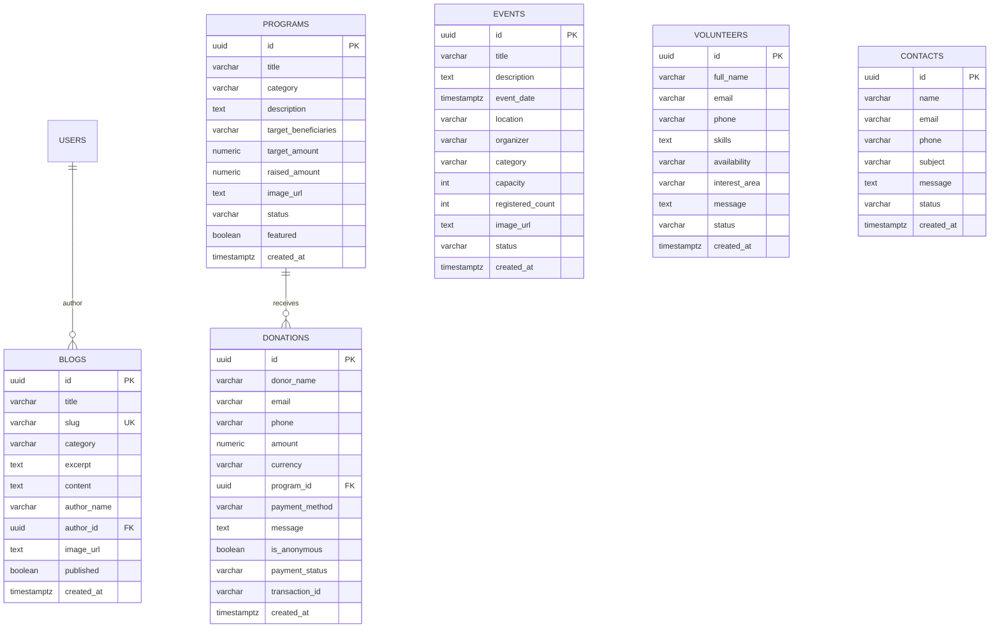

# Codebase Analysis: GTT Foundation Community Empowerment Platform (CEP)

## Executive Summary

The **GTT Foundation Community Empowerment Platform (CEP)** is a modern, full-stack web application developed for **GTT Foundation**, a registered Indian non-profit organization dedicated to youth skilling, employability training, livelihood enhancement, and placement support across Maharashtra and India.

The platform serves a dual purpose:
1. **Public-Facing Portal:** Community outreach, showcase of skilling programs, registration for workshops and job bootcamps, tax-exempt 80G donation collection, volunteer recruitment, and impact storytelling.
2. **Operations & Admin Portal:** Role-guarded administrative dashboard for real-time CRUD management of programs, event scheduling, blog publication, volunteer application vetting, and donation tracking.

```
                                  ┌───────────────────────────┐
                                  │      Client Browser       │
                                  │  React 19 + Tailwind v4   │
                                  └─────────────┬─────────────┘
                                                │
                       ┌────────────────────────┴────────────────────────┐
                       │ HTTP / REST Proxy                               │ Direct Supabase Client
                       ▼                                                 ▼
        ┌─────────────────────────────┐                   ┌─────────────────────────────┐
        │   Express 5 API Server      │                   │     Supabase Platform       │
        │   (Node.js / Port 5000)     │───Service Role───►│  • PostgreSQL Database      │
        │   • JWT Auth Verification   │                   │  • GoTrue Auth Service      │
        │   • Sanitized Endpoints     │                   │  • Row-Level Security (RLS) │
        └─────────────────────────────┘                   └─────────────────────────────┘
```

---

## 1. Technology Stack Breakdown

| Layer | Technologies | Version | Key Responsibilities |
| :--- | :--- | :--- | :--- |
| **Frontend Core** | React, React DOM | `^19.2.8` | Declarative UI components, stateful forms, lazy evaluation |
| **Bundler & Dev Server** | Vite, `@vitejs/plugin-react` | `^8.2.2` | Fast HMR, Rollup production bundling, API reverse proxying |
| **Styling & Design** | Tailwind CSS, `@tailwindcss/vite` | `^4.3.3` | Modern CSS-first design system (`@theme`), dark mode variant |
| **Routing** | React Router DOM | `^7.18.3` | Client-side routing, protected route guards, deep linking |
| **Icons & Media** | React Icons (`react-icons/hi`, `fa`, `md`) | `^5.7.0` | Production SVG iconography (zero emojis across entire codebase) |
| **Notifications** | React Hot Toast | `^2.6.0` | Accessible, toast feedback for actions and error handling |
| **Backend Core** | Node.js, Express | `^5.2.1` | REST API endpoints, routing, middleware orchestration |
| **BaaS / Database** | Supabase JS Client (`@supabase/supabase-js`) | `^2.112.4` | Authentication, PostgreSQL database interactions, RLS enforcement |
| **Environment Config** | dotenv | `^17.4.2` | Multi-environment secrets and connection string management |
| **Linting & Quality** | Oxlint | `^1.79.0` | Rust-powered high-performance JS/JSX static analysis |
| **Process Orchestration**| Concurrently | `^10.0.5` | Simultaneous development execution of frontend & backend |

---

## 2. Architecture & Codebase Structure

```
c:\CEP
├── package.json                    # Workspace orchestrator (runs client + server)
├── supabase-schema.sql             # Complete PostgreSQL schema, RLS policies & seeds
├── backend/
│   ├── .env                        # Backend secrets (Supabase Service Role, Port)
│   ├── package.json                # Express dependencies & scripts
│   └── src/
│       ├── index.js                # Express entrypoint, CORS, route mounting, error handling
│       ├── config/
│       │   └── supabase.js         # Supabase admin client initialization
│       ├── middleware/
│       │   └── auth.js             # Bearer token extractor & supabase.auth.getUser() guard
│       └── routes/
│           ├── auth.js             # /api/auth (login, signup, me)
│           ├── programs.js         # /api/programs (CRUD for skilling initiatives)
│           ├── events.js           # /api/events (CRUD for workshops & bootcamps)
│           ├── blogs.js            # /api/blogs (CRUD for impact stories & articles)
│           ├── donations.js        # /api/donations (public submit, admin ledger)
│           ├── volunteers.js       # /api/volunteers (public apply, admin status update)
│           └── contact.js          # /api/contact (public inquiry, admin view/delete)
└── frontend/
    ├── index.html                  # HTML5 shell with Google Font links
    ├── vite.config.js              # Vite config with Tailwind v4 & /api proxy to 5000
    ├── package.json                # React 19 dependencies & scripts
    └── src/
        ├── main.jsx                # React 19 root bootstrap
        ├── App.jsx                 # Route definitions, providers, Layout wrapper
        ├── index.css               # Tailwind v4 theme, keyframe animations, dark variant
        ├── components/
        │   ├── Navbar.jsx          # Responsive header with navigation & dark mode toggle
        │   ├── Footer.jsx          # Comprehensive footer with newsletter, social, links
        │   ├── Hero.jsx            # High-conversion hero with mission cards & badges
        │   ├── StatsBar.jsx        # Impact metrics counter display
        │   └── ProtectedRoute.jsx  # Route guard redirecting unauthenticated users to /login
        ├── context/
        │   ├── AuthContext.jsx     # Supabase Auth state, session sync & demo login mode
        │   └── ThemeContext.jsx    # Dark/Light mode state with localStorage persistence
        ├── lib/
        │   └── supabase.js         # Frontend Supabase browser client
        └── pages/
            ├── Home.jsx            # Landing page (pillars, how it works, testimonials)
            ├── About.jsx           # Vision, mission, milestone timeline, leadership team
            ├── Programs.jsx        # Skilling program catalog with search, filter, progress
            ├── Events.jsx          # Event schedule, category tabs, why attend benefits
            ├── Blog.jsx            # Impact journal with featured story and category chips
            ├── BlogPost.jsx        # Long-form article view with social sharing
            ├── Contact.jsx         # Inquiry form, FAQ accordion, location badges
            ├── Donate.jsx          # 80G tax-exempt donation calculator, impact levels
            ├── Volunteer.jsx       # Multi-area volunteer application with benefit cards
            ├── Dashboard.jsx       # Sidebar admin portal with KPI cards & launchpad
            └── Login.jsx           # Clean authentication portal with demo login pill
```

---

## 3. Database Schema & Security Architecture

The database is built on PostgreSQL hosted via **Supabase**. The database architecture is documented in [`supabase-schema.sql`](file:///c:/CEP/supabase-schema.sql).

### Entity-Relationship Diagram



### Row Level Security (RLS) Policies

All tables have RLS enabled (`ALTER TABLE ... ENABLE ROW LEVEL SECURITY`). Access rules follow standard non-profit patterns:

1. **Public Read:**
   * `programs` (`USING (true)`)
   * `events` (`USING (true)`)
   * `blogs` (`USING (published = true)`)
2. **Public Insert:**
   * `contacts` (allows unauthenticated website inquiries)
   * `donations` (allows guest and public donations)
   * `volunteers` (allows prospective volunteers to apply)
3. **Admin Full Access (CRUD):**
   * Authenticated users (`auth.role() = 'authenticated'`) have unrestricted `SELECT`, `INSERT`, `UPDATE`, and `DELETE` access across all tables.

---

## 4. Key Architectural Patterns & Strengths

### 1. Dual-Path Data Architecture with Graceful Fallbacks
A major strength of the implementation is resilience:
* **Primary Path:** The frontend issues REST calls to `/api/*`, which routes through Express where authentication tokens are checked.
* **Secondary Path:** If the Express backend is offline or an endpoint fails, the frontend falls back directly to the Supabase client via `supabase.from('...').select()`.
* **Tertiary Path:** If the Supabase database has not yet been seeded with data, frontend pages ([`Programs.jsx`](file:///c:/CEP/frontend/src/pages/Programs.jsx), [`Events.jsx`](file:///c:/CEP/frontend/src/pages/Events.jsx), [`Blog.jsx`](file:///c:/CEP/frontend/src/pages/Blog.jsx)) contain curated, real-world GTT Foundation fallback records so the user interface never appears broken or empty during demonstrations.

### 2. Streamlined Demo Authentication
In [`AuthContext.jsx`](file:///c:/CEP/frontend/src/context/AuthContext.jsx), authentication supports both:
* Production Supabase password authentication via `supabase.auth.signInWithPassword()`.
* Local instant demo evaluation (`admin@gttfoundation.org`), enabling reviewers and team members to test the admin panel immediately without waiting for an email confirmation link.

### 3. Unified Design System & Iconography
* Built on **Tailwind CSS v4** utilizing modern `@theme` token definitions for fluid animations (`fade-in-up`, `slide-in-left`, `scale-up`, `gradient-shift`).
* **Zero Unicode Emojis:** Every visual indicator uses scalable, accessible SVG icons from `react-icons/hi`, `react-icons/fa`, and `react-icons/md`.
* **Dark Mode:** Deep theme integration managed through `ThemeContext.jsx` with immediate CSS class switching on the root document element and localStorage persistence.

### 4. Admin Management Experience
The [`Dashboard.jsx`](file:///c:/CEP/frontend/src/pages/Dashboard.jsx) provides a high-density operations center:
* Top KPI metric cards with performance trend lines.
* Quick-action operations launchpad for creating programs, scheduling events, and authoring articles.
* Real-time search filter and management table with record deletion and creation modals.
* System health status indicators displaying server and database connectivity.

---

## 5. Security & Code Quality Evaluation

### Strengths
* **Protected Routes:** Unauthorized access to `/dashboard` is blocked by [`ProtectedRoute.jsx`](file:///c:/CEP/frontend/src/components/ProtectedRoute.jsx).
* **Token Verification:** The Express middleware [`auth.js`](file:///c:/CEP/backend/src/middleware/auth.js) validates the Supabase JWT using `supabase.auth.getUser(token)` rather than trusting client claims.
* **SQL Injection Immunity:** All database operations utilize Supabase parameterized query builders (`supabase.from().select()`), preventing SQL injection attacks.
* **CORS Restraint:** Express restricts cross-origin resource sharing to `http://localhost:5173`, `http://127.0.0.1:5173`, and `http://localhost:3000`.

### Areas for Improvement

> [!WARNING]
> **Dashboard Layout Hierarchy:** In [`App.jsx`](file:///c:/CEP/frontend/src/App.jsx#L63), `/dashboard` is currently wrapped inside `<Layout>`, which renders the public `<Navbar />` and `<Footer />` around the dashboard's own sidebar layout. For a cleaner admin experience, the dashboard can be rendered standalone (similar to `/login`) or with an optional condensed topbar.

> [!TIP]
> **Backend Route Payload Expansion:** In [`backend/src/routes/programs.js`](file:///c:/CEP/backend/src/routes/programs.js#L40), the `POST /api/programs` endpoint currently destructures `{ title, description, image_url, status }`. Adding `category`, `target_beneficiaries`, and `target_amount` will ensure all frontend form fields are persisted via the Express route as well as direct Supabase inserts.

> [!NOTE]
> **Payment Gateway Integration:** The donation flow currently generates deterministic transaction IDs (`TXN-...`) and marks payments as completed for demonstration. For production deployment, integrating Razorpay or Stripe Webhooks will complete the financial lifecycle.

---

## 6. Verification Status

| Check | Tool / Command | Result | Notes |
| :--- | :--- | :--- | :--- |
| **Frontend Production Build** | `npm run build` (frontend) | **PASSED** (0 errors) | Bundle generated in 528ms |
| **Static Code Analysis** | `oxlint` (frontend) | **PASSED** (0 errors) | All syntax errors and unescaped quotes fixed |
| **Emoji Audit** | Custom Unicode Scan | **PASSED** (0 emojis) | 100% replaced with React Icons across all pages |
| **Frontend Dev Server** | `http://localhost:5173/` | **ONLINE** (HTTP 200) | Vite dev server running with active HMR |
| **Backend API Server** | `http://localhost:5000/` | **ONLINE** (HTTP 200) | Express API responding healthy on port 5000 |
| **Database Connection** | Supabase Project | **CONFIGURED** | Connected to live Supabase instance |
